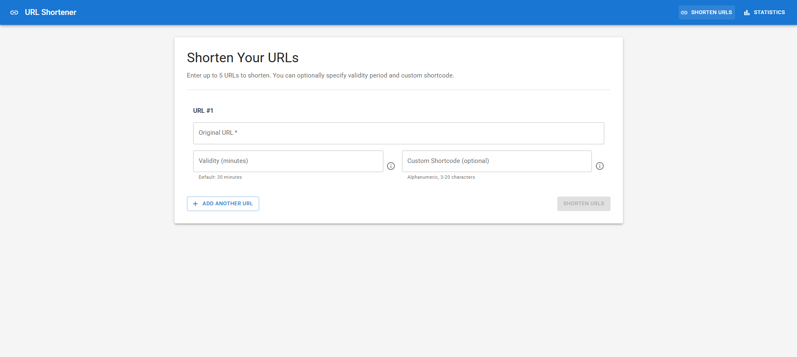
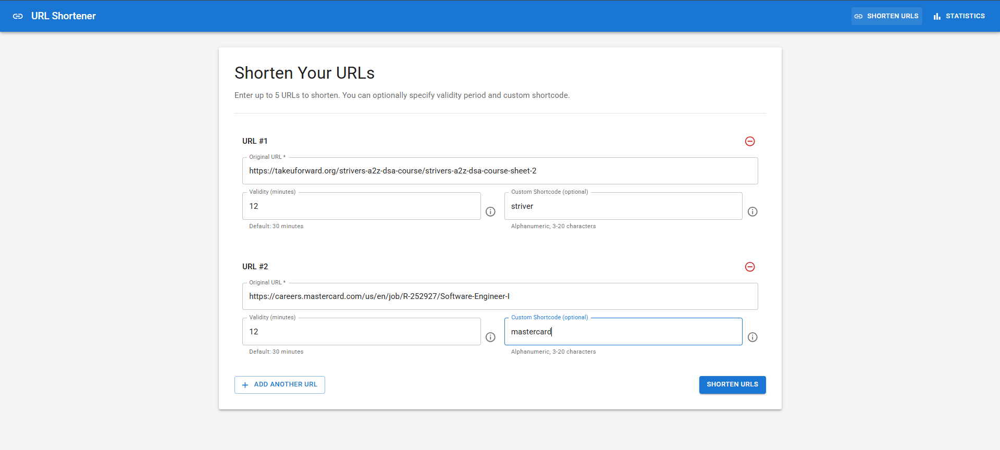
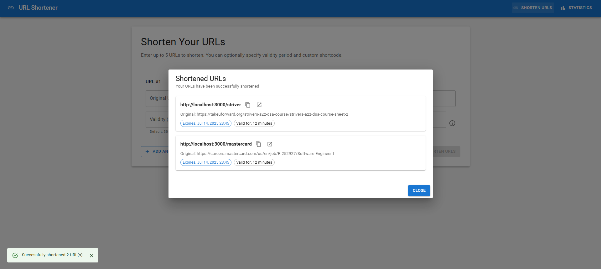
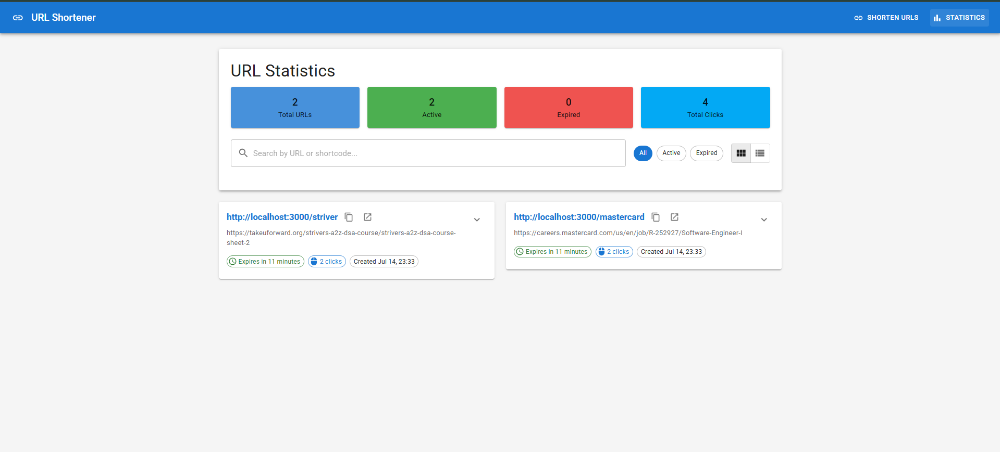

# URL Shortener React Application

 <!-- Replace with your image path -->

A fully functional URL shortener web application built with React and Material-UI.

[](LICENSE)
[](https://reactjs.org/)
[](#)

---

## Table of Contents

- [Features](#features)
- [Installation](#installation)
- [Usage](#usage)
- [Screenshots](#screenshots)
- [Contributing](#contributing)
- [License](#license)

---

## Features

- Shorten up to 5 URLs concurrently
- Custom shortcode support
- Configurable URL validity period (default: 30 minutes)
- Click analytics and statistics
- Client-side URL persistence
- Responsive design with Material-UI
- Comprehensive error handling
- Logging middleware integration


## Installation

1. Clone the repository:
   ```bash
   git clone https://github.com/abhikumar0670/URL_Shortener
   cd your-repo
   ```
2. Install dependencies:
   ```bash
   npm install
   ```
3. Start the development server:
   ```bash
   npm start
   ```

---

## Usage

1. Enter a URL in the input field.
2. Optionally, provide a custom shortcode and set the validity period.
3. Click "Shorten" to generate a short URL.
4. View analytics and statistics for each shortened URL.

---

## Screenshots

| Home Page |
|-------------|-------------|-------------|
|  |  |  |

| Analytics Page |
|---------------|
|  |

---

## Contributing

Contributions are welcome! Please open issues or submit pull requests for improvements.

---

## License

This project is licensed under the MIT License. See the [LICENSE](LICENSE) file for details.
